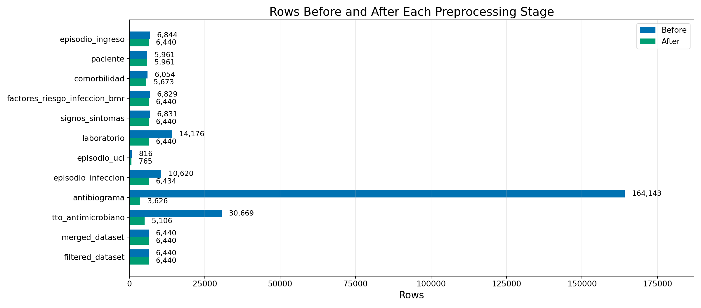
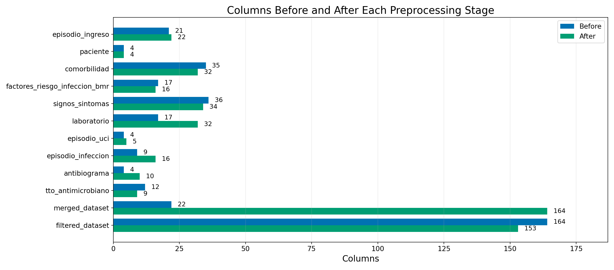
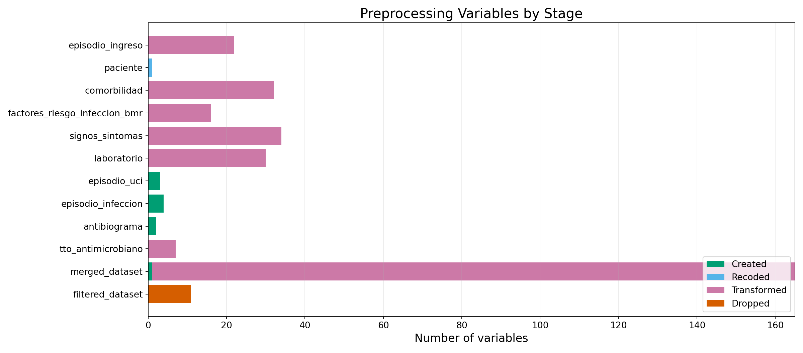
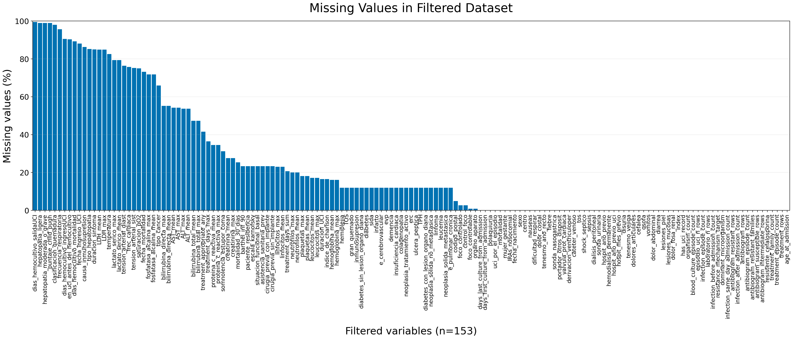
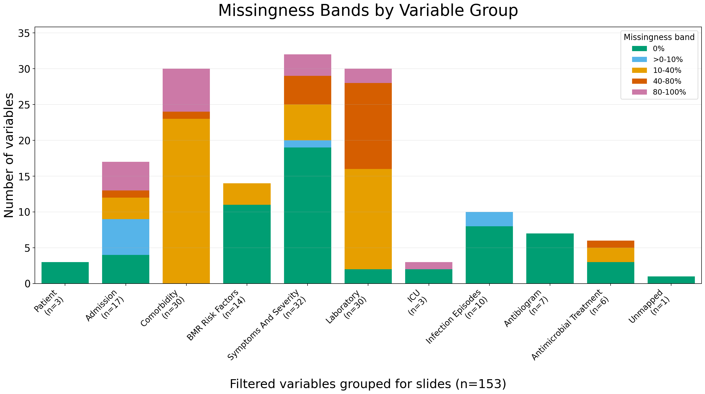
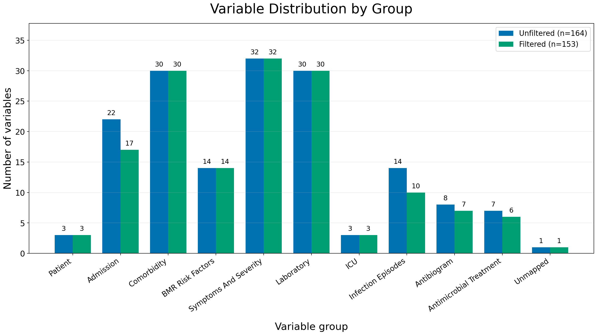

# BATHECOMB Preprocessing Report

First-pass admission-level preprocessing report for the BATHECOMB SQLite data. The pipeline aggregates patient, admission, infection, antibiogram, treatment, laboratory, symptom, comorbidity, and risk-factor tables to one row per patient admission date.

## Dataset Shapes

- Full dataset: `6,440 rows x 164 columns`
- Filtered/model-compatible dataset: `6,440 rows x 153 columns`
- Filtered stage removed `11` columns and kept `153` columns

## Figures

## Most Feature-Creating Stages

- `episodio_infeccion`: `4` created variables
- `episodio_uci`: `3` created variables
- `antibiograma`: `2` created variables
- `merged_dataset`: `1` created variables
- `_pipeline_run`: `0` created variables
- `factores_riesgo_infeccion_bmr`: `0` created variables
- `comorbilidad`: `0` created variables
- `paciente`: `0` created variables

## Predictive Targets

| Model | Target column | Samples | Classes | Majority class | Majority class % |
|---|---|---:|---:|---|---:|
| Sepsis | `sepsis` | 6,440 | 2 | 0 | 69.3% |
| Mortality 30 days | `mortalidad_30_dias` | 4,805 | 2 | 0.0 | 78.1% |
| Resistance mechanism | `resistance_mechanism_target` | 6,440 | 6 | NEGATIVE | 87.7% |
| Cephalosporin resistance | `resistente_cefalosporina` | 6,440 | 2 | NEGATIVE | 82.6% |

| Model | Class | Samples | % within target |
|---|---|---:|---:|
| Sepsis | 0 | 4,465 | 69.3% |
| Sepsis | 1 | 1,975 | 30.7% |
| Mortality 30 days | 0.0 | 3,754 | 78.1% |
| Mortality 30 days | 1.0 | 1,051 | 21.9% |
| Resistance mechanism | BLEE | 578 | 9.0% |
| Resistance mechanism | CARB | 10 | 0.2% |
| Resistance mechanism | CARBAPENEMASE | 39 | 0.6% |
| Resistance mechanism | MR | 129 | 2.0% |
| Resistance mechanism | MRSA | 35 | 0.5% |
| Resistance mechanism | NEGATIVE | 5,649 | 87.7% |
| Cephalosporin resistance | NEGATIVE | 5,321 | 82.6% |
| Cephalosporin resistance | RESIST_CEFALOSPORINAS_3a_4a | 1,119 | 17.4% |

| Model | Exclusions or grouping |
|---|---|
| Sepsis | Binary sepsis flag from signos_sintomas aggregated at admission level. |
| Mortality 30 days | Admission-level 30-day mortality when available. |
| Resistance mechanism | Coarse resistance mechanism label from episodio_infeccion.fenotipo_resistencia. |
| Cephalosporin resistance | Derived from resistant antibiogram rows mapped to antimicrobial families. |

## Target Evolution

| Domain | Target version | Target column | Samples | Classes | Majority class | Majority class % | Top classes |
|---|---|---|---:|---:|---|---:|---|
| Etiology | Dominant organism | `dominant_microorganism` | 6,440 | 73 | Escherichia coli | 37.0% | Escherichia coli: 2,382; Klebsiella pneumoniae: 922; Staphylococcus aureus: 831; Pseudomonas aeruginosa: 626 |
| Resistance | Resistance mechanism | `resistance_mechanism_target` | 6,440 | 6 | NEGATIVE | 87.7% | NEGATIVE: 5,649; BLEE: 578; MR: 129; CARBAPENEMASE: 39 |
| Resistance | Antibiogram resistant families | `antibiogram_resistant_families` | 6,440 | 22 | NEGATIVE | 52.0% | NEGATIVE: 3,346; Penicilinas: 2,879; Sulfamidas: 1,297; Cefalosporinas 2 gen: 1,180 |
| Resistance | Cephalosporin yes/no | `resistente_cefalosporina` | 6,440 | 2 | NEGATIVE | 82.6% | NEGATIVE: 5,321; RESIST_CEFALOSPORINAS_3a_4a: 1,119 |

| Domain | Target version | Notes |
|---|---|---|
| Etiology | Dominant organism | Most frequent microorganism among infection episodes in the admission. |
| Resistance | Resistance mechanism | Coarse phenotype mechanism from infection episodes; NEGATIVE if no phenotype is recorded. |
| Resistance | Antibiogram resistant families | Antimicrobial families with at least one resistant antibiogram result in the admission. |
| Resistance | Cephalosporin yes/no | Binary third/fourth-generation cephalosporin resistance target. |

## Prediction Target Details

### Sepsis

Admission-level sepsis target.

- Dataset shape: `6,440` rows x `153` columns
- Target column: `sepsis`
- Classes: `2`

| Class | Rows | % within target |
|---|---:|---:|
| 0 | 4,465 | 69.3% |
| 1 | 1,975 | 30.7% |
| Total | 6,440 | 100.0% |

### Dominant organism

Most frequent microorganism in the admission.

- Dataset shape: `6,440` rows x `153` columns
- Target column: `dominant_microorganism`
- Classes: `73`

| Class | Rows | % within target |
|---|---:|---:|
| Escherichia coli | 2,382 | 37.0% |
| Klebsiella pneumoniae | 922 | 14.3% |
| Staphylococcus aureus | 831 | 12.9% |
| Pseudomonas aeruginosa | 626 | 9.7% |
| Enterobacter cloacae | 190 | 3.0% |
| Proteus mirabilis | 170 | 2.6% |
| Klebsiella pneumoniae ssp pneumoniae | 157 | 2.4% |
| Serratia marcescens | 128 | 2.0% |
| Staphylococcus aureus ssp aureus | 122 | 1.9% |
| Klebsiella aerogenes | 121 | 1.9% |
| Klebsiella oxytoca | 120 | 1.9% |
| Enterobacter cloacae complex | 82 | 1.3% |
| Escherichia coli BLEE | 62 | 1.0% |
| Morganella morganii | 51 | 0.8% |
| Stenotrophomonas maltophilia | 46 | 0.7% |
| Acinetobacter baumannii | 43 | 0.7% |
| Enterobacter cloacae ssp cloacae | 39 | 0.6% |
| Klebsiella pneumoniae BLEE | 34 | 0.5% |
| Citrobacter koseri | 33 | 0.5% |
| Citrobacter freundii | 32 | 0.5% |
| Raoultella ornithinolytica | 23 | 0.4% |
| Staphylococcus aureus MR | 19 | 0.3% |
| Serratia marcescens ssp marcescens | 19 | 0.3% |
| Klebsiella variicola | 17 | 0.3% |
| Salmonella enterica | 17 | 0.3% |
| Pantoea agglomerans | 16 | 0.2% |
| Enterobacter kobei | 16 | 0.2% |
| Pseudomonas aeruginosa MR | 15 | 0.2% |
| Acinetobacter lwoffii | 9 | 0.1% |
| Morganella morganii ssp morganii | 7 | 0.1% |
| Other | 91 | 1.4% |
| Total | 6,440 | 100.0% |

### Resistance mechanism

Coarse resistance mechanism target from infection phenotype labels.

- Dataset shape: `6,440` rows x `153` columns
- Target column: `resistance_mechanism_target`
- Classes: `6`

| Class | Rows | % within target |
|---|---:|---:|
| NEGATIVE | 5,649 | 87.7% |
| BLEE | 578 | 9.0% |
| MR | 129 | 2.0% |
| CARBAPENEMASE | 39 | 0.6% |
| MRSA | 35 | 0.5% |
| CARB | 10 | 0.2% |
| Total | 6,440 | 100.0% |

### Antibiogram resistant families

Multilabel antimicrobial family resistance derived from antibiogram rows.

- Dataset shape: `6,440` rows x `153` columns
- Target column: `antibiogram_resistant_families`
- Classes: `22`

| Class | Rows | % within target |
|---|---:|---:|
| NEGATIVE | 3,346 | 52.0% |
| Penicilinas | 2,879 | 44.7% |
| Sulfamidas | 1,297 | 20.1% |
| Cefalosporinas 2 gen | 1,180 | 18.3% |
| Cefalosporinas 3/4 gen | 1,119 | 17.4% |
| Quinolonas | 1,041 | 16.2% |
| Cefalosporinas 1 gen | 866 | 13.4% |
| Aminoglucosidos | 729 | 11.3% |
| Monobactamicos | 569 | 8.8% |
| Carbapenemas | 426 | 6.6% |
| Polimixinas | 360 | 5.6% |
| Fosfomicinas | 355 | 5.5% |
| Tetraciclinas | 330 | 5.1% |
| Nitrofuranos | 266 | 4.1% |
| Anfenicoles | 224 | 3.5% |
| Macrolidos | 206 | 3.2% |
| Lincosamidas | 161 | 2.5% |
| Other/Unmapped | 30 | 0.5% |
| Otros antibacterianos | 22 | 0.3% |
| Rifamicinas | 12 | 0.2% |
| Glicopeptidos | 3 | 0.0% |
| Oxazolidinonas | 1 | 0.0% |
| Total label assignments | 15,422 | 239.5% |
| Total patients | 6,440 | 100.0% |

### Cephalosporin resistance

Binary cephalosporin 3a/4a resistance target.

- Dataset shape: `6,440` rows x `153` columns
- Target column: `resistente_cefalosporina`
- Classes: `2`

| Class | Rows | % within target |
|---|---:|---:|
| NEGATIVE | 5,321 | 82.6% |
| RESIST_CEFALOSPORINAS_3a_4a | 1,119 | 17.4% |
| Total | 6,440 | 100.0% |

## Warnings

- `tto_antimicrobiano`: dias_tratamiento requires review: negative_rows=139, rows_over_365_days=111

## Missingness Snapshot

Top missing columns in the filtered dataset:

- `dias_hemocultivo_salidaUCI`: `99.5%` missing
- `hepatopatia_ligera`: `99.0%` missing
- `hepatopatia_moderada_o_grave`: `99.0%` missing
- `puntaje_child_pugh`: `99.0%` missing
- `clasificacion_quemadura`: `98.1%` missing
- `frecuencia_respiratoria`: `95.7%` missing
- `dias_hemocultivo_ingresoUCI`: `90.6%` missing
- `en_uci_antes_del_hemocultivo`: `90.4%` missing
- `dias_hemocultivo_mortalidad`: `89.3%` missing
- `fecha_ingreso_UCI`: `88.1%` missing
- `causa_inmunosupresion`: `86.3%` missing
- `tipo_hepatopatia`: `85.3%` missing
- `duracion_sintoma`: `85.0%` missing
- `LDH_mean`: `84.9%` missing
- `LDH_max`: `84.9%` missing

## Table Summary

- `_pipeline_run`: rows `0` -> `0`, columns `0` -> `0`, dropped `0`, warnings `0`
- `episodio_ingreso`: rows `6,844` -> `6,440`, columns `21` -> `22`, dropped `0`, warnings `0`
- `paciente`: rows `5,961` -> `5,961`, columns `4` -> `4`, dropped `0`, warnings `0`
- `comorbilidad`: rows `6,054` -> `5,673`, columns `35` -> `32`, dropped `0`, warnings `0`
- `factores_riesgo_infeccion_bmr`: rows `6,829` -> `6,440`, columns `17` -> `16`, dropped `0`, warnings `0`
- `signos_sintomas`: rows `6,831` -> `6,440`, columns `36` -> `34`, dropped `0`, warnings `0`
- `laboratorio`: rows `14,176` -> `6,440`, columns `17` -> `32`, dropped `0`, warnings `0`
- `episodio_uci`: rows `816` -> `765`, columns `4` -> `5`, dropped `0`, warnings `0`
- `episodio_infeccion`: rows `10,620` -> `6,434`, columns `9` -> `16`, dropped `0`, warnings `0`
- `antibiograma`: rows `164,143` -> `3,626`, columns `4` -> `10`, dropped `0`, warnings `0`
- `tto_antimicrobiano`: rows `30,669` -> `5,106`, columns `12` -> `9`, dropped `0`, warnings `1`
- `merged_dataset`: rows `6,440` -> `6,440`, columns `22` -> `164`, dropped `0`, warnings `0`
- `filtered_dataset`: rows `6,440` -> `6,440`, columns `164` -> `153`, dropped `11`, warnings `0`
