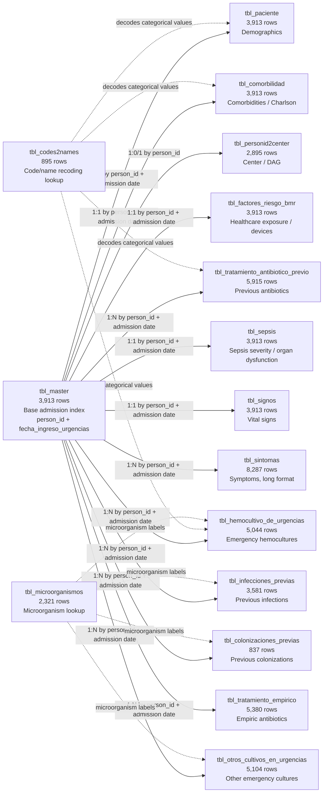
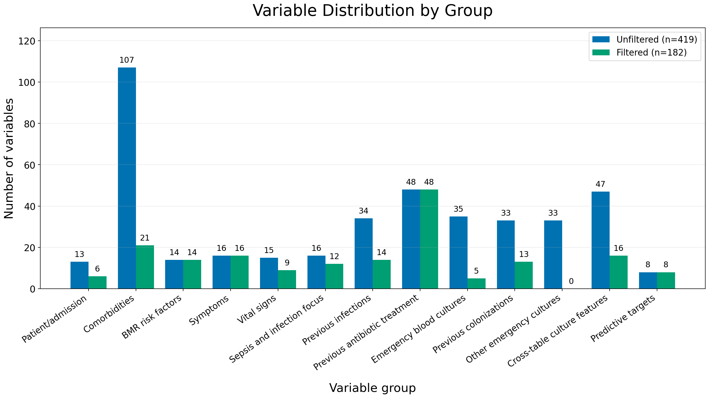

# Raw Input Tables Before Preprocessing

## Table Contents

| Table | Rows | Contains | Relationship to admission index |
|---|---:|---|---|
| `tbl_master` | 3,913 | Base valid admission records | One row per `person_id` + `fecha_ingreso_urgencias` |
| `tbl_paciente` | 3,913 | Demographics: age, sex, postal code, pregnancy, residence | 1:1 |
| `tbl_personid2center` | 2,895 | Center and DAG metadata | 1:0/1 by `person_id` |
| `tbl_comorbilidad` | 3,913 | Comorbidities and Charlson variables | 1:1 |
| `tbl_factores_riesgo_bmr` | 3,913 | Healthcare exposure and device-related risk factors | 1:1 |
| `tbl_sepsis` | 3,913 | Sepsis, shock, SOFA/qSOFA and organ dysfunction components | 1:1 |
| `tbl_signos` | 3,913 | Vital signs and abnormality flags | 1:1 |
| `tbl_sintomas` | 8,287 | Symptoms and duration, long format | 1:N |
| `tbl_infecciones_previas` | 3,581 | Previous infections, organisms, BMR and phenotype | 1:N |
| `tbl_tratamiento_antibiotico_previo` | 5,915 | Previous antibiotic administrations, route and treatment days | 1:N |
| `tbl_colonizaciones_previas` | 837 | Previous colonization organisms, BMR and phenotype | 1:N |
| `tbl_hemocultivo_de_urgencias` | 5,044 | Emergency hemoculture results, organisms, BMR and resistance phenotype | 1:N |
| `tbl_otros_cultivos_en_urgencias` | 5,104 | Other emergency culture results, organisms, BMR and resistance phenotype | 1:N |
| `tbl_tratamiento_empirico` | 5,380 | Empiric antibiotic treatment records | 1:N |
| `tbl_codes2names` | 895 | Categorical value/code recoding dictionary | Lookup table |
| `tbl_microorganismos` | 2,321 | Microorganism code/name labels | Lookup table |

## Variable Type Distribution

Distribution of variables in the unfiltered `preprocess_test.csv` dataset and
the filtered `preprocess_test_filtered.csv` dataset. The classification uses
the final CSV headers, the preprocessing audit log, and the source SQLite table
schemas.

| Variable type | Unfiltered variables | Filtered variables | Removed by filter |
|---|---:|---:|---:|
| Demographics | 11 | 6 | 5 |
| Comorbidities | 107 | 21 | 86 |
| Signs / sepsis | 75 | 63 | 12 |
| Infection history | 83 | 43 | 40 |
| Antibiotics | 48 | 48 | 0 |
| Cultures | 68 | 5 | 63 |
| Derived variables | 53 | 22 | 31 |
| **Total** | **445** | **208** | **237** |

Mapping used:
`Demographics` includes `tbl_paciente` and `tbl_personid2center` identifiers
and metadata; `Signs / sepsis` includes `tbl_signos`, `tbl_sepsis`, and
`tbl_sintomas`; `Infection history` includes previous infection flags,
healthcare/device exposure, previous infections, and previous colonizations;
`Cultures` includes emergency hemoculture and other emergency culture variables;
`Derived variables` includes `cross_table_features` and variables created in
`target_building`.

## Sepsis Case Count Check

The sepsis target was checked between the source SQLite table
`db_mepram_sepsis_vf.sqlite3::tbl_sepsis` and the filtered preprocessing output
`preprocess_test_filtered.csv`, using `person_id` as the row key after
administrative admission-date fields are removed from the filtered output.

| Sepsis label | Encoded value | SQLite cases | Filtered table cases | Difference |
|---|---:|---:|---:|---:|
| Negative | 0 | 1,989 | 1,989 | 0 |
| Positive | 1 | 1,924 | 1,924 | 0 |
| **Total** |  | **3,913** | **3,913** | **0** |

All 3,913 keyed rows matched exactly between SQLite and the filtered table.
