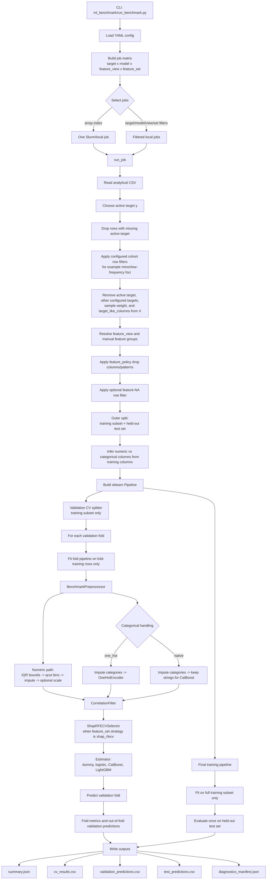

# Predictive ML Benchmark

Reusable benchmark package for comparing predictive models across targets,
model families, and feature-selection strategies.

The package is intentionally outside `legacy/hpc_processing` so the existing
HPC scripts can remain as historical/project-specific workflows while this
package becomes the reusable implementation.

## Current Scope

This first slice establishes:

- YAML config loading.
- `target x model x feature_view x feature_set` job-matrix expansion.
- Manual feature groups and feature views for comparing alternative clinical
  representations, such as raw, binary, or categorical vital-sign encodings.
- Configurable row filters for cohort restrictions and feature-missingness
  row exclusion, with audit counts.
- Model-specific feature policies for scaling, categorical handling, and
  correlation-filter behavior.
- Leakage-safe pipeline construction for imputation, encoding, scaling, qcut
  binning, IQR handling, correlation filtering, SHAP-RFECV feature selection,
  and the estimator.
- Cross-validation training and evaluation for dummy baselines, logistic
  regression, CatBoost, and LightGBM.
- Slurm array helper output.
- Slurm script rendering.
- Resource limits based on `SLURM_CPUS_PER_TASK`.
- Model registry stubs for dummy, logistic regression, random forest, CatBoost,
  LightGBM, and XGBoost.
- Homogeneous job output contract with `summary.json` and
  `diagnostics_manifest.json`.

Feature-selection caching, tuning, richer diagnostics, aggregate reporting, and
additional model runners are the next implementation slices.

## Leakage Rule

All data-dependent transformations must be learned from training data only.
The benchmark pipeline builder keeps these steps inside a fitted pipeline:

- missing-value imputation;
- one-hot category learning;
- scaling means/standard deviations;
- qcut bin learning;
- IQR outlier bounds;
- correlation-filter decisions;
- feature-selection decisions;
- model fitting.

Each job first creates a held-out test set using `split.test_size`. The test set
is not used for cross-validation, feature selection, model selection, or
preprocessing decisions. Cross-validation is then run only inside the remaining
training rows. Each validation fold builds and fits its own pipeline using only
that fold's training rows. After validation, a final pipeline is fitted on the
full training subset and evaluated once on the held-out test set.

## Helper Commands

The benchmark is launched through `ml_benchmark/run_benchmark.py`. The script reads
one YAML config, expands the configured job matrix, selects either one job or a
filtered subset, and then runs each selected job.

Print the job matrix:

```bash
python ml_benchmark/run_benchmark.py \
  --config mepram/config/benchmark_mepram.yml \
  --print-job-matrix
```

Print the Slurm array line:

```bash
python ml_benchmark/run_benchmark.py \
  --config mepram/config/benchmark_mepram.yml \
  --print-slurm-array
```

Print a full Slurm script:

```bash
python ml_benchmark/run_benchmark.py \
  --config mepram/config/benchmark_mepram.yml \
  --print-slurm-script
```

Run one matrix entry in dry-run mode:

```bash
python ml_benchmark/run_benchmark.py \
  --config mepram/config/benchmark_mepram.yml \
  --array-index 15 \
  --dry-run
```

Run one train/evaluate job:

```bash
python ml_benchmark/run_benchmark.py \
  --config mepram/config/benchmark_mepram.yml \
  --target sepsis \
  --model logistic \
  --feature-view raw_vitals \
  --feature-set all_features
```

Build aggregate comparison reports after jobs have completed:

```bash
python ml_benchmark/run_benchmark.py \
  --config mepram/config/benchmark_mepram.yml \
  --build-report
```

Completed jobs write `summary.json`, `cv_results.csv`,
`validation_predictions.csv`, `test_predictions.csv`,
`diagnostics_manifest.json`, `final_features.csv`, `imputation_report.csv`,
`correlation_matrix.csv`, `correlation_pairs.csv`,
`shap_rfecv_history.csv`, and `shap_rfecv_selected_features.csv` under
`outputs/ml_benchmark/.../jobs/<job_slug>/`.

`summary.json` includes a `benchmark_audit` section with row counts, feature
counts, target-like feature removal, feature-view filtering, imputation
strategies, qcut-created variables, IQR outlier handling, categorical encoding,
correlation filtering, and feature-selection status. Large tabular artifacts
are referenced from the summary and written as CSV files.

The runner removes every configured target column from `X`. Additional
target-like columns can be listed under `data.target_like_columns`; this is
where culture, organism, and resistance outcomes that are not the active target
should live.

## Aggregate Reports

`--build-report` scans completed job folders under the configured `output_dir`
and writes aggregate artifacts under `outputs/ml_benchmark/.../reports/`.
Root-level report files are reserved for tables and plots that compare more
than one job or target:

- `job_comparison.csv`: one row per completed job with validation/test metrics.
- `model_rankings.csv`: per-target ranks using each target's main metric.
- `class_level_metrics.csv`: precision, recall, F1, and support by class.
- `calibration_metrics.csv`: Brier score and ECE by class and top-label.
- `calibration_curves.csv`: binned reliability data behind calibration plots.
- `threshold_metrics.csv`: binary-target metrics across probability thresholds.
- `threshold_summary.csv`: best binary thresholds by F1, F-beta, balanced
  accuracy, and Youden's J.
- `diagnostic_artifacts.csv`: index of generated diagnostic plots.

The same aggregate tables are also split into one folder per clinical question:
`outputs/ml_benchmark/.../reports/<target>/`. Target folders also contain
target-specific validation-vs-test plots:

- `reports/<target>/job_comparison.csv`
- `reports/<target>/model_rankings.csv`
- `reports/<target>/validation_vs_test__<target>.png`
- `reports/<target>/validation_test_bars__<target>.png`

Per-job diagnostic plots are stored with the job itself under
`outputs/ml_benchmark/.../jobs/<job_slug>/reports/`:

- `<split>_confusion_matrix.png`
- `<split>_calibration_curve.png`
- `<split>_roc_curve.png`
- `<split>_pr_curve.png`

Binary jobs get ROC, PR, and calibration plots using the positive-class
probability. Multiclass jobs get confusion matrices, class-level metrics, and
one-vs-rest ROC/PR curves when class probability columns are available.

## Row Filters

Row filtering is configured separately from feature preprocessing because it
changes the cohort before train/test splitting. Cohort filters are applied after
missing active-target rows are removed and before the held-out test split.
Feature-NA row filters are applied after target removal, feature-view selection,
and feature-policy column drops, so they use the actual candidate feature matrix
for the current job.

Available cohort rule types are:

- `exclude_values`: drop rows where `column` is one of `values`.
- `include_values`: keep only rows where `column` is one of `values`.
- `drop_missing`: drop rows where `column` is missing.
- `min_frequency`: keep levels in `column` that meet `min_count` and/or
  `min_fraction`; `drop_missing: false` keeps missing rows.

The example config includes disabled filters for excluding minor foci and
keeping only common foci. Enabling them makes the row counts appear in
`summary.json` under `benchmark_audit.rows.custom_filters`.

```yaml
row_filters:
  cohort_filters:
    - name: exclude_minor_foci
      type: exclude_values
      enabled: false
      column: foco
      values: [catéter venoso, vías altas respiratorias, cardiovascular]

    - name: keep_common_foci
      type: min_frequency
      enabled: false
      column: foco
      min_fraction: 0.04
      drop_missing: false

  feature_na_filter:
    enabled: false
    mode: max_fraction
    max_missing_fraction: 0.50
    include_patterns: ["*"]
```

`feature_na_filter.mode` can be `any`, `all`, or `max_fraction`. When no row
filters are configured the audit reports `not_configured`; when filters are
present but disabled it reports `disabled`; when enabled filters run it reports
`applied` with before/after row counts.

## Pipeline Structure

At launch time, the CLI does not hard-code model inputs. The YAML config
controls the data path, targets, row filters, models, feature views, feature
policies, split strategy, and output location.



There are two leakage boundaries. First, the held-out test set is separated
before validation and is not touched until final evaluation. Second, inside the
validation fold loop, IQR bounds, qcut bins, imputation values, one-hot
categories, scaling parameters, correlation-filter decisions, feature-selection
decisions, and model parameters are all fitted only on the fold-training rows.

## Feature Views

Feature views are different representations of the same analytical table.
They are intentionally separate from feature selection:

- `feature_view`: which candidate columns are allowed into the model.
- `feature_set`: whether all candidates are used or a selector/cap is applied.

Manual feature groups define mutually meaningful alternatives:

```yaml
feature_groups:
  temperature:
    alternatives:
      raw:
        include: [temperatura]
        exclude: [temperatura_recoded, sintoma_fiebre, sintoma_fiebre_categorico]
      category:
        include: [temperatura_recoded, sintoma_fiebre_categorico]
        exclude: [temperatura, sintoma_fiebre]

feature_views:
  - name: raw_vitals
    include_patterns: ["*"]
    groups:
      temperature: raw
```

## Feature Selection

Feature sets control whether the model uses all candidates or a selected subset.
`strategy: shap_rfecv` runs a train-fitted SHAP recursive feature elimination
step inside the sklearn pipeline, after preprocessing and correlation filtering
and before the final estimator.

For each selector fit, the benchmark:

- evaluates the current feature subset with internal cross-validation on the
  current training split only;
- fits a temporary selector estimator on the current training split, optionally
  using model-specific lighter parameters;
- computes mean absolute SHAP importance;
- removes the least important features recursively;
- keeps the best-scoring selected ranking, capped by `max_features` when
  configured.

The held-out test set is never used by SHAP-RFECV. Each outer validation fold
gets its own selected features learned only from that fold's training rows. The
final test evaluation gets a selected feature set learned only from the full
training subset.

Feature-selection rankings are cached under
`outputs/ml_benchmark/.../feature_selection_cache/`. The cache key includes the
actual training rows, target values, post-preprocessing feature matrix,
feature-view/model/policy context, and selector settings, but deliberately
excludes `max_features`. This lets `shap_rfecv_top_20`, `shap_rfecv_top_50`,
and `shap_rfecv_top_100` reuse the same train-fitted SHAP-RFECV ranking and
apply different top-N caps without recomputing selection. If the selected
ranking has fewer than the requested cap, the benchmark keeps the full selected
ranking rather than adding lower-ranked eliminated features.

Selector behavior is configured independently from feature-set caps:

```yaml
feature_selection:
  cache_enabled: true
  shap_rfecv:
    cv_splits: 2
    step_fraction: 0.50
    min_features_to_select: 20
    max_shap_rows: 1000
    max_selector_rows: 2500
    selector_estimator_params:
      logistic:
        max_iter: 1000
      lightgbm:
        n_estimators: 80
      catboost:
        iterations: 80
```

`max_selector_rows` speeds up RFECV by fitting the selector on a stratified
sample of the current training split. It does not use validation or test rows.
`selector_estimator_params` lets expensive final models use cheaper selector
estimators without changing the final estimator used for training/evaluation.
After each completed job, the benchmark refreshes
`outputs/ml_benchmark/.../feature_selection_cache_index.csv` with one row per
cache file, including selector settings, cache feature counts, and best score.

```yaml
feature_sets:
  - name: all_features
    strategy: none

  - name: shap_rfecv_top_20
    strategy: shap_rfecv
    max_features: 20
```

The final pipeline feature list is written to `final_features.csv`; for
SHAP-RFECV jobs it includes the RFECV rank and final mean absolute SHAP score.
The ranked SHAP-RFECV selected-feature list is written to
`shap_rfecv_selected_features.csv` with `mean_abs_shap` and `score_available`
columns; the recursive elimination trace is written to `shap_rfecv_history.csv`
when available.

## Hyperparameter Tuning

Optuna tuning is configured per benchmark job and is disabled by default.
When enabled, each `target x model x feature_view x feature_set` job gets its
own study and cached best-parameter file. Tuning is fitted and scored only
inside the training subset created after the outer held-out test split. The
held-out test set is evaluated once after tuning selects the final parameters.

```yaml
tuning:
  enabled: false
  n_trials: 25
  timeout_seconds:
  cv_splits: 3
  metric:
  direction: auto
  reuse_existing: true
  storage: sqlite
  models:
    - logistic
    - catboost
    - lightgbm
```

If `metric` is empty, tuning uses the target `main_metric`, falling back to
`roc_auc` for binary targets and `f1_macro` otherwise. `direction: auto`
minimizes `log_loss` and maximizes other metrics. With `reuse_existing: true`,
the runner reuses `best_params.json` when present; otherwise it resumes or
creates the job's SQLite Optuna study.

Tuning artifacts are written under the job output directory:

- `best_params.json`: selected metric, direction, best value, and best params.
- `tuning_trials.csv`: trial numbers, values, states, and parameter columns.
- `optuna_study.db`: the SQLite Optuna study for this exact job.
- `optuna_optimization_history.html`: Optuna optimization history plot.
- `optuna_param_importances.html`: Optuna parameter importance plot.
- `optuna_slice.html`: Optuna slice plot.

These files are also listed in `diagnostics_manifest.json` and the tuning block
inside `summary.json`. Older shared study files under
`outputs/ml_benchmark/.../optuna_studies/<job_slug>.db` are copied into the job
folder when present so existing studies can still be reused.

## Feature Policies

Feature policies define model-specific preprocessing rules. For example,
logistic regression can report/drop correlated features more aggressively while
tree models can keep correlation filtering as report-only or disabled:

```yaml
feature_policies:
  logistic_default:
    categorical_handling: one_hot
    scale: standard
    impute_numeric: median
    impute_categorical: most_frequent
    qcut_numeric: none
    qcut_bins: 4
    iqr_outlier_handling: train_fit
    correlation_filter:
      enabled: true
      threshold: 0.80
      mode: report_then_drop
      manual_groups_first: true
    calibration:
      enabled: false

  logistic_qcut_only:
    categorical_handling: one_hot
    scale: standard
    impute_numeric: median
    impute_categorical: most_frequent
    qcut_numeric: replace
    qcut_bins: 4
    iqr_outlier_handling: train_fit
    correlation_filter:
      enabled: true
      threshold: 0.80
      mode: report_then_drop
      manual_groups_first: true
    calibration:
      enabled: false

  logistic_calibrated:
    categorical_handling: one_hot
    scale: standard
    impute_numeric: median
    impute_categorical: most_frequent
    qcut_numeric: none
    iqr_outlier_handling: train_fit
    correlation_filter:
      enabled: true
      threshold: 0.80
      mode: report_then_drop
      manual_groups_first: true
    calibration:
      enabled: true
      method: sigmoid
      cv: 3
      ensemble: true

  tree_default:
    categorical_handling: one_hot
    scale: none
    impute_numeric: median
    impute_categorical: most_frequent
    qcut_numeric: none
    iqr_outlier_handling: train_fit
    correlation_filter:
      enabled: false
      mode: report_only

models:
  - name: logistic
    feature_policy: logistic_default
  - name: logistic_qcut_only
    feature_policy: logistic_qcut_only
  - name: logistic_calibrated
    feature_policy: logistic_calibrated
  - name: lightgbm
    feature_policy: tree_default
```

`categorical_handling: one_hot` is the default for sklearn, XGBoost, and
LightGBM-style estimators that need numeric matrices. `categorical_handling:
native` keeps categorical columns as imputed strings for CatBoost and passes
their column names to CatBoost as native categorical features. Numeric scaling
is controlled per policy with `scale: none`, `standard`, `minmax`, or `robust`;
tree policies normally keep `scale: none`.

Numeric and categorical imputation are also policy-specific. `impute_numeric:
median` and `impute_categorical: most_frequent` are the current defaults.
`qcut_numeric: none` keeps raw numeric variables without generated qcut
features. `qcut_numeric: append` adds train-fitted qcut columns named
`<variable>_qcut` beside the raw numeric source. `qcut_numeric: replace`
creates `<variable>_qcut` and removes the raw source for variables with enough
distinct numeric values; low-cardinality variables that cannot be binned remain
unchanged. `qcut_bins` controls the requested number of bins.
`iqr_outlier_handling: train_fit` learns IQR bounds on the training fold and
sets values outside those bounds to missing before imputation. Use
`iqr_multiplier` to change the bound width.

`calibration.enabled: true` wraps the final model in sklearn
`CalibratedClassifierCV`. The calibration model is fitted inside the same
training fold as the rest of the pipeline, then validation/test rows are only
transformed and scored through the fitted pipeline. Use separate model names and
feature policies, such as `logistic` vs `logistic_calibrated`, when calibration
should be a benchmark comparison rather than the default behavior.

## Split Strategy

The config includes an explicit split strategy so the same package can support
cross-validation tuning now and train/validation/test evaluation later:

```yaml
split:
  strategy: cross_validation
  cv_splits: 5
  test_size: 0.20
  validation_size:
  random_state: 99
  stratify: true
```

With this strategy, `test_size` controls the outer held-out test split.
`cv_splits` controls the validation folds created only within the training
subset.
