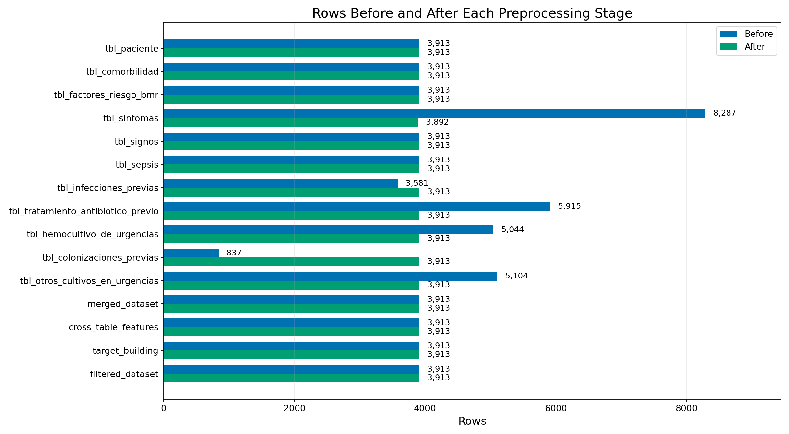
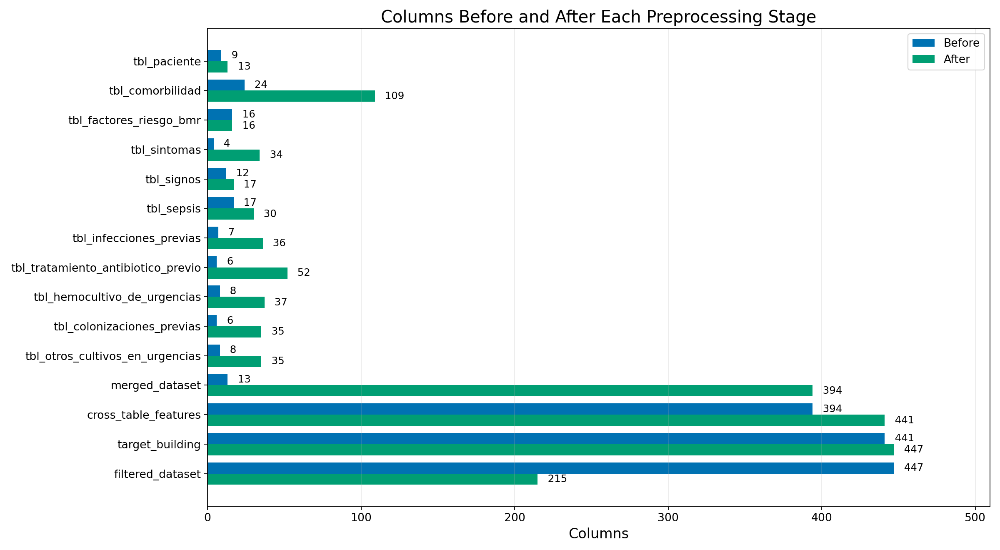
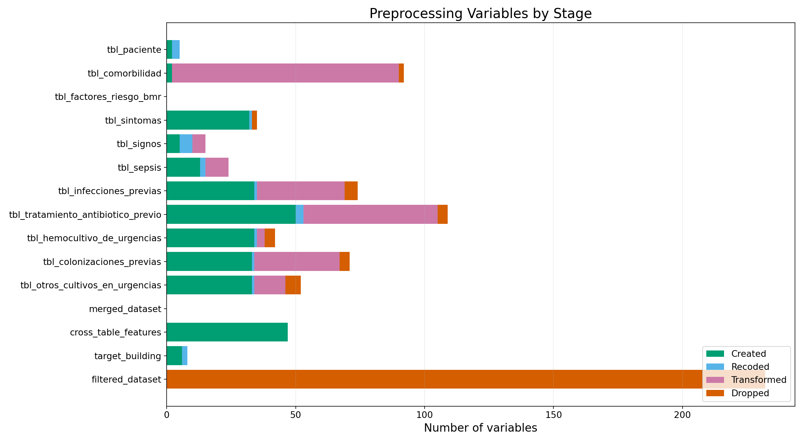
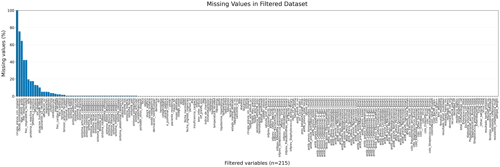
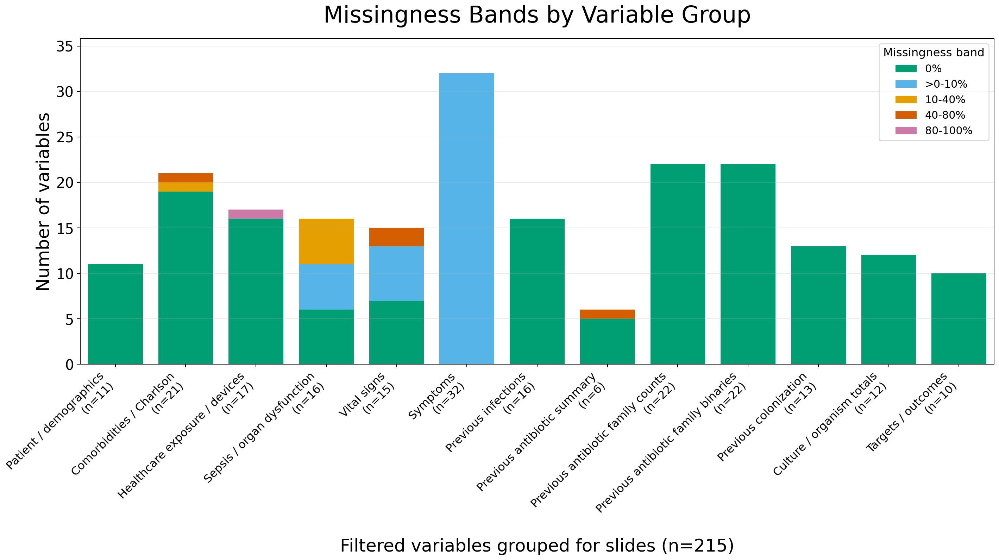
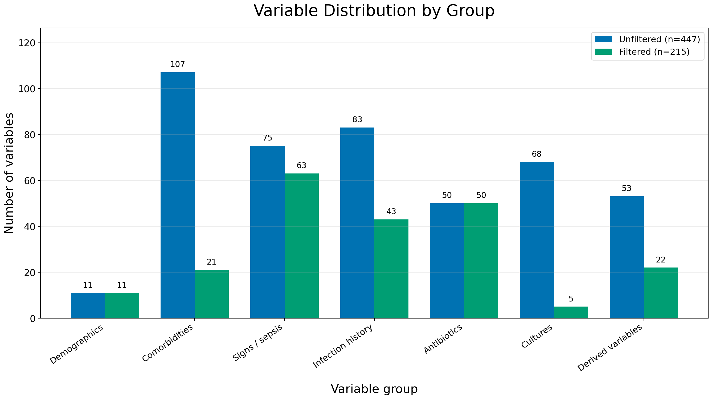

# Preprocessing Report

This report summarizes the preprocessing audit logs. It is intended for clinician review and pipeline QA.

## Dataset Shapes

- Full dataset: `3,913 rows x 447 columns`
- Filtered/model-compatible dataset: `3,913 rows x 215 columns`
- Final pipeline stage before filtering: `3,913` rows and `447` columns
- Filtered stage removed `232` columns and kept `215` columns

## Figures

## Most Feature-Creating Stages

- `tbl_tratamiento_antibiotico_previo`: `50` created variables
- `cross_table_features`: `47` created variables
- `tbl_infecciones_previas`: `34` created variables
- `tbl_hemocultivo_de_urgencias`: `34` created variables
- `tbl_colonizaciones_previas`: `33` created variables
- `tbl_otros_cultivos_en_urgencias`: `33` created variables
- `tbl_sintomas`: `32` created variables
- `tbl_sepsis`: `13` created variables

## Predictive Targets

| Model | Target column | Samples | Classes | Majority class | Majority class % |
|---|---|---:|---:|---|---:|
| Model 1 - Sepsis | `sepsis` | 3,913 | 2 | Sepsis (-) | 50.8% |
| Model 2 - Etiology | `resultado_hemo_grouped` | 3,913 | 3 | Negative blood culture | 58.2% |
| Model 3 - Resistance | `resistente_cefalosporina` | 1,636 | 2 | Not resistant | 85.8% |

| Model | Class | Samples | % within target |
|---|---|---:|---:|
| Model 1 - Sepsis | Sepsis (-) | 1,989 | 50.8% |
| Model 1 - Sepsis | Sepsis (+) | 1,924 | 49.2% |
| Model 2 - Etiology | Gram-negative bacillus | 1,320 | 33.7% |
| Model 2 - Etiology | Gram-positive coccus | 316 | 8.1% |
| Model 2 - Etiology | Negative blood culture | 2,277 | 58.2% |
| Model 3 - Resistance | Not resistant | 1,404 | 85.8% |
| Model 3 - Resistance | Resistant to cephalosporins 3a/4a | 232 | 14.2% |

| Model | Exclusions or grouping |
|---|---|
| Model 1 - Sepsis | No exclusions; binary target over the full cohort. |
| Model 2 - Etiology | Grouped hemoculture target. NEGATIVE includes negative blood cultures and non-target or unmapped detected organisms. |
| Model 3 - Resistance | Restricted to grouped positive blood cultures (resultado_hemo_grouped != NEGATIVE); grouped as binary cephalosporin 3a/4a resistance. |

## Target Evolution

| Domain | Target version | Target column | Samples | Classes | Majority class | Majority class % | Top classes |
|---|---|---|---:|---:|---|---:|---|
| Etiology | Microorganism target | `resultado_hemo_mo` | 3,913 | 110 | NEGATIVE | 52.8% | NEGATIVE: 2,067; Escherichia coli: 836; Klebsiella pneumoniae: 201; Staphylococcus aureus: 168 |
| Etiology | Clinical organism grouping | `resultado_hemo` | 3,913 | 10 | NEGATIVE | 53.0% | NEGATIVE: 2,072; Escherichia coli: 850; Klebsiella pneumoniae: 210; _Other bacteria: 198 |
| Etiology | Gram grouped | `resultado_hemo_grouped` | 3,913 | 3 | NEGATIVE | 58.2% | NEGATIVE: 2,277; Bacilo gram-: 1,320; Coco gram+: 316 |
| Resistance | Individual phenotype combinations | `fenotipo_resistencia_individual` | 3,913 | 75 | NEGATIVE | 80.6% | NEGATIVE: 3,152; Bacilo Gram negativo resistente a amoxicilina/clavulánico: 153; Coco Gram positivo resistente a ampicilina o penicilina: 98; Bacilo Gram negativo resistente a ciprofloxacino: 67 |
| Resistance | Antibiotic family combinations | `fenotipo_resistencia` | 3,913 | 24 | NEGATIVE | 80.6% | NEGATIVE: 3,152; Penicilinas: 377; Cefalosporinas 3 gen + Cefalosporinas 4 gen + Penicilinas + Quinolonas: 88; Penicilinas + Quinolonas: 75 |
| Resistance | Cephalosporin yes/no | `resistente_cefalosporina` | 3,913 | 2 | NEGATIVE | 94.0% | NEGATIVE: 3,678; RESIST_CEFALOSPORINAS_3a_4a: 235 |

| Domain | Target version | Notes |
|---|---|---|
| Etiology | Microorganism target | Hemoculture microorganism target after clinician coinfection resolution. |
| Etiology | Clinical organism grouping | Configured clinical organism grouping from the preprocessing pipeline. |
| Etiology | Gram grouped | Pipeline target grouped into negative, Gram-negative bacillus, and Gram-positive coccus. |
| Resistance | Individual phenotype combinations | Individual resistance phenotype labels before antibiotic-family grouping. |
| Resistance | Antibiotic family combinations | Pipeline target after mapping raw resistance phenotypes to antibiotic families. |
| Resistance | Cephalosporin yes/no | Final binary target: any cephalosporin 3a/4a resistance versus negative. |

## Prediction Target Details

### Sepsis

Binary sepsis prediction target.

- Dataset shape: `3,913` rows x `215` columns
- Target column: `sepsis`
- Classes: `2`

| Class | Rows | % within target |
|---|---:|---:|
| Sepsis (-) | 1,989 | 50.8% |
| Sepsis (+) | 1,924 | 49.2% |

### Etiology - microorganisms

Original microorganism target before clinical grouping; shown as top 50 classes plus Other.

- Dataset shape: `3,913` rows x `215` columns
- Target column: `resultado_hemo_mo`
- Classes: `110`

| Class | Rows | % within target |
|---|---:|---:|
| NEGATIVE | 2,067 | 52.8% |
| Escherichia coli | 836 | 21.4% |
| Klebsiella pneumoniae | 201 | 5.1% |
| Staphylococcus aureus | 168 | 4.3% |
| Streptococcus pneumoniae | 106 | 2.7% |
| Pseudomonas aeruginosa | 83 | 2.1% |
| Proteus mirabilis | 39 | 1.0% |
| Enterobacter cloacae | 37 | 0.9% |
| Staphylococcus epidermidis | 33 | 0.8% |
| Enterococcus faecalis | 32 | 0.8% |
| Staphylococcus hominis | 31 | 0.8% |
| Klebsiella oxytoca | 28 | 0.7% |
| Enterococcus faecium | 17 | 0.4% |
| Salmonella enterica | 13 | 0.3% |
| Klebsiella aerogenes | 10 | 0.3% |
| Serratia marcescens | 10 | 0.3% |
| Citrobacter freundii | 8 | 0.2% |
| Haemophilus influenzae | 8 | 0.2% |
| Streptococcus agalactiae | 8 | 0.2% |
| Citrobacter koseri | 8 | 0.2% |
| Bacteroides fragilis | 8 | 0.2% |
| Streptococcus gallolyticus | 7 | 0.2% |
| Streptococcus anginosus | 6 | 0.2% |
| Morganella morganii | 5 | 0.1% |
| Staphylococcus capitis | 5 | 0.1% |
| Streptococcus mitis | 5 | 0.1% |
| Staphylococcus haemolyticus | 5 | 0.1% |
| Listeria monocytogenes | 4 | 0.1% |
| Corynebacterium afermentans | 4 | 0.1% |
| género Salmonella | 4 | 0.1% |
| Streptococcus oralis | 4 | 0.1% |
| género Streptococcus | 4 | 0.1% |
| Streptococcus parasanguinis | 4 | 0.1% |
| Candida glabrata | 4 | 0.1% |
| Fusobacterium nucleatum | 3 | 0.1% |
| Providencia stuartii | 3 | 0.1% |
| Streptococcus dysgalactiae | 3 | 0.1% |
| Brevibacterium epidermidis | 3 | 0.1% |
| Clostridium perfringens | 3 | 0.1% |
| Candida parapsilosis | 2 | 0.1% |
| género Brevibacillus | 2 | 0.1% |
| Candida albicans | 2 | 0.1% |
| Corynebacterium striatum | 2 | 0.1% |
| género Elizabethkingia | 2 | 0.1% |
| Streptococcus sanguinis | 2 | 0.1% |
| Parvimonas micra | 2 | 0.1% |
| Streptococcus equi | 2 | 0.1% |
| Micrococcus luteus | 2 | 0.1% |
| Streptococcus beta - hemolítico | 2 | 0.1% |
| Bacteroides thetaiotaomicron | 2 | 0.1% |
| Other | 64 | 1.6% |

### Resistance - individual phenotypes

Individual resistance phenotype combinations before antibiotic-family grouping.

- Dataset shape: `3,913` rows x `215` columns
- Target column: `fenotipo_resistencia_individual`
- Classes: `75`

| Class | Rows | % within target |
|---|---:|---:|
| NEGATIVE | 3,152 | 80.6% |
| Bacilo Gram negativo resistente a amoxicilina/clavulánico | 153 | 3.9% |
| Coco Gram positivo resistente a ampicilina o penicilina | 98 | 2.5% |
| Bacilo Gram negativo resistente a ciprofloxacino | 67 | 1.7% |
| Bacilo Gram negativo resistente a amoxicilina/clavulánico + Bacilo Gram negativo resistente a piperacilina/tazobactam | 50 | 1.3% |
| Bacilo Gram negativo resistente a amoxicilina/clavulánico + Bacilo Gram negativo resistente a ciprofloxacino | 48 | 1.2% |
| Coco Gram positivo resistente a meticilina | 33 | 0.8% |
| Bacilo Gram negativo resistente a amoxicilina/clavulánico + Bacilo Gram negativo resistente a cefepima + Bacilo Gram negativo resistente a ceftazidima + Bacilo Gram negativo resistente a ceftrixona o cefotaxima + Bacilo Gram negativo resistente a ciprofloxacino + Bacilo Gram negativo resistente a piperacilina/tazobactam | 31 | 0.8% |
| Bacilo Gram negativo resistente a cefepima + Bacilo Gram negativo resistente a ceftazidima + Bacilo Gram negativo resistente a ceftrixona o cefotaxima + Bacilo Gram negativo resistente a ciprofloxacino | 29 | 0.7% |
| Bacilo Gram negativo resistente a amoxicilina/clavulánico + Bacilo Gram negativo resistente a cefepima + Bacilo Gram negativo resistente a ceftazidima + Bacilo Gram negativo resistente a ceftrixona o cefotaxima + Bacilo Gram negativo resistente a ciprofloxacino | 28 | 0.7% |
| Coco Gram positivo resistente a ampicilina o penicilina + Coco Gram positivo resistente a meticilina | 24 | 0.6% |
| Bacilo Gram negativo resistente a amoxicilina/clavulánico + Bacilo Gram negativo resistente a ciprofloxacino + Bacilo Gram negativo resistente a piperacilina/tazobactam | 17 | 0.4% |
| Bacilo Gram negativo resistente a cefepima + Bacilo Gram negativo resistente a ceftazidima + Bacilo Gram negativo resistente a ceftrixona o cefotaxima | 12 | 0.3% |
| Bacilo Gram negativo resistente a amoxicilina/clavulánico + Bacilo Gram negativo resistente a cefepima + Bacilo Gram negativo resistente a ceftazidima + Bacilo Gram negativo resistente a ceftrixona o cefotaxima + Bacilo Gram negativo resistente a ciprofloxacino + Bacilo Gram negativo resistente a piperacilina/tazobactam + Coco Gram positivo resistente a ampicilina o penicilina | 10 | 0.3% |
| Bacilo Gram negativo resistente a amoxicilina/clavulánico + Bacilo Gram negativo resistente a ceftazidima + Bacilo Gram negativo resistente a ceftrixona o cefotaxima + Bacilo Gram negativo resistente a ciprofloxacino + Bacilo Gram negativo resistente a piperacilina/tazobactam | 9 | 0.2% |
| Bacilo Gram negativo resistente a amoxicilina/clavulánico + Bacilo Gram negativo resistente a ceftrixona o cefotaxima | 9 | 0.2% |
| Bacilo Gram negativo resistente a piperacilina/tazobactam | 8 | 0.2% |
| Bacilo Gram negativo resistente a amoxicilina/clavulánico + Coco Gram positivo resistente a ampicilina o penicilina | 7 | 0.2% |
| Bacilo Gram negativo resistente a ceftazidima + Bacilo Gram negativo resistente a ceftrixona o cefotaxima + Bacilo Gram negativo resistente a ciprofloxacino | 7 | 0.2% |
| Bacilo Gram negativo resistente a ceftrixona o cefotaxima | 6 | 0.2% |
| Bacilo Gram negativo resistente a amoxicilina/clavulánico + Bacilo Gram negativo resistente a cefepima + Bacilo Gram negativo resistente a ceftazidima + Bacilo Gram negativo resistente a ceftrixona o cefotaxima + Bacilo Gram negativo resistente a ciprofloxacino + Coco Gram positivo resistente a ampicilina o penicilina | 5 | 0.1% |
| Bacilo Gram negativo resistente a amoxicilina/clavulánico + Bacilo Gram negativo resistente a cefepima + Bacilo Gram negativo resistente a ceftazidima + Bacilo Gram negativo resistente a ceftrixona o cefotaxima | 5 | 0.1% |
| Bacilo Gram negativo resistente a amoxicilina/clavulánico + Bacilo Gram negativo resistente a cefepima + Bacilo Gram negativo resistente a ceftazidima + Bacilo Gram negativo resistente a ceftrixona o cefotaxima + Bacilo Gram negativo resistente a piperacilina/tazobactam | 5 | 0.1% |
| Bacilo Gram negativo resistente a amoxicilina/clavulánico + Bacilo Gram negativo resistente a cefepima + Bacilo Gram negativo resistente a ceftrixona o cefotaxima | 4 | 0.1% |
| Bacilo Gram negativo resistente a amoxicilina/clavulánico + Bacilo Gram negativo resistente a ceftrixona o cefotaxima + Bacilo Gram negativo resistente a ciprofloxacino + Bacilo Gram negativo resistente a piperacilina/tazobactam | 4 | 0.1% |
| Bacilo Gram negativo resistente a amoxicilina/clavulánico + Bacilo Gram negativo resistente a ciprofloxacino + Coco Gram positivo resistente a ampicilina o penicilina | 4 | 0.1% |
| Bacilo Gram negativo resistente a amoxicilina/clavulánico + Bacilo Gram negativo resistente a ceftazidima + Bacilo Gram negativo resistente a ceftrixona o cefotaxima + Bacilo Gram negativo resistente a ciprofloxacino | 4 | 0.1% |
| Bacilo Gram negativo resistente a ciprofloxacino + Coco Gram positivo resistente a ampicilina o penicilina | 4 | 0.1% |
| Bacilo Gram negativo resistente a amoxicilina/clavulánico + Bacilo Gram negativo resistente a ceftazidima + Bacilo Gram negativo resistente a ceftrixona o cefotaxima + Bacilo Gram negativo resistente a piperacilina/tazobactam | 4 | 0.1% |
| Bacilo Gram negativo resistente a cefepima + Bacilo Gram negativo resistente a ceftrixona o cefotaxima + Bacilo Gram negativo resistente a ciprofloxacino | 3 | 0.1% |
| Bacilo Gram negativo resistente a cefepima + Bacilo Gram negativo resistente a ceftazidima + Bacilo Gram negativo resistente a ceftrixona o cefotaxima + Coco Gram positivo resistente a ampicilina o penicilina | 3 | 0.1% |
| Bacilo Gram negativo resistente a amoxicilina/clavulánico + Bacilo Gram negativo resistente a cefepima + Bacilo Gram negativo resistente a ceftazidima + Bacilo Gram negativo resistente a ciprofloxacino + Bacilo Gram negativo resistente a piperacilina/tazobactam | 3 | 0.1% |
| Bacilo Gram negativo resistente a amoxicilina/clavulánico + Bacilo Gram negativo resistente a ceftazidima + Bacilo Gram negativo resistente a piperacilina/tazobactam | 3 | 0.1% |
| Bacilo Gram negativo resistente a amoxicilina/clavulánico + Bacilo Gram negativo resistente a cefepima + Bacilo Gram negativo resistente a ciprofloxacino + Bacilo Gram negativo resistente a piperacilina/tazobactam | 3 | 0.1% |
| Bacilo Gram negativo resistente a cefepima + Bacilo Gram negativo resistente a ceftazidima + Bacilo Gram negativo resistente a ceftrixona o cefotaxima + Bacilo Gram negativo resistente a ciprofloxacino + Coco Gram positivo resistente a ampicilina o penicilina | 3 | 0.1% |
| Bacilo Gram negativo resistente a amoxicilina/clavulánico + Bacilo Gram negativo resistente a piperacilina/tazobactam + Coco Gram positivo resistente a ampicilina o penicilina | 3 | 0.1% |
| Bacilo Gram negativo resistente a amoxicilina/clavulánico + Bacilo Gram negativo resistente a ceftazidima + Bacilo Gram negativo resistente a ceftrixona o cefotaxima | 3 | 0.1% |
| Bacilo Gram negativo resistente a amoxicilina/clavulánico + Bacilo Gram negativo resistente a ceftrixona o cefotaxima + Bacilo Gram negativo resistente a ciprofloxacino | 3 | 0.1% |
| Bacilo Gram negativo resistente a meropenem | 2 | 0.1% |
| Bacilo Gram negativo resistente a cefepima + Bacilo Gram negativo resistente a ciprofloxacino | 2 | 0.1% |
| Bacilo Gram negativo resistente a amoxicilina/clavulánico + Bacilo Gram negativo resistente a cefepima + Bacilo Gram negativo resistente a ceftrixona o cefotaxima + Bacilo Gram negativo resistente a ciprofloxacino | 2 | 0.1% |
| Bacilo Gram negativo resistente a ceftrixona o cefotaxima + Bacilo Gram negativo resistente a ciprofloxacino + Bacilo Gram negativo resistente a meropenem | 2 | 0.1% |
| Bacilo Gram negativo resistente a cefepima + Bacilo Gram negativo resistente a ceftazidima + Bacilo Gram negativo resistente a ciprofloxacino + Bacilo Gram negativo resistente a piperacilina/tazobactam | 2 | 0.1% |
| Bacilo Gram negativo resistente a amoxicilina/clavulánico + Bacilo Gram negativo resistente a cefepima + Bacilo Gram negativo resistente a ceftazidima + Bacilo Gram negativo resistente a ceftrixona o cefotaxima + Bacilo Gram negativo resistente a ciprofloxacino + Bacilo Gram negativo resistente a meropenem + Bacilo Gram negativo resistente a piperacilina/tazobactam | 2 | 0.1% |
| Bacilo Gram negativo resistente a cefepima + Bacilo Gram negativo resistente a ceftazidima + Bacilo Gram negativo resistente a ciprofloxacino | 2 | 0.1% |
| Bacilo Gram negativo resistente a amoxicilina/clavulánico + Bacilo Gram negativo resistente a ceftazidima + Bacilo Gram negativo resistente a ceftrixona o cefotaxima + Bacilo Gram negativo resistente a ciprofloxacino + Bacilo Gram negativo resistente a piperacilina/tazobactam + Coco Gram positivo resistente a ampicilina o penicilina | 2 | 0.1% |
| Bacilo Gram negativo resistente a amoxicilina/clavulánico + Bacilo Gram negativo resistente a cefepima + Bacilo Gram negativo resistente a ceftazidima + Bacilo Gram negativo resistente a ceftolozano/tazobactam + Bacilo Gram negativo resistente a ceftrixona o cefotaxima + Bacilo Gram negativo resistente a ciprofloxacino + Bacilo Gram negativo resistente a piperacilina/tazobactam | 2 | 0.1% |
| Bacilo Gram negativo resistente a amoxicilina/clavulánico + Bacilo Gram negativo resistente a cefepima | 2 | 0.1% |
| Bacilo Gram negativo resistente a ceftrixona o cefotaxima + Bacilo Gram negativo resistente a ciprofloxacino | 2 | 0.1% |
| Coco Gram positivo resistente a ampicilina o penicilina + Coco Gram positivo resistente a vancomicina | 2 | 0.1% |
| Bacilo Gram negativo resistente a ciprofloxacino + Bacilo Gram negativo resistente a meropenem + Bacilo Gram negativo resistente a piperacilina/tazobactam | 1 | 0.0% |
| Bacilo Gram negativo resistente a cefepima + Bacilo Gram negativo resistente a ceftazidima + Bacilo Gram negativo resistente a ceftazidima/avibactam + Bacilo Gram negativo resistente a ciprofloxacino + Bacilo Gram negativo resistente a meropenem + Bacilo Gram negativo resistente a piperacilina/tazobactam | 1 | 0.0% |
| Bacilo Gram negativo resistente a ceftazidima + Bacilo Gram negativo resistente a piperacilina/tazobactam | 1 | 0.0% |
| Bacilo Gram negativo resistente a amoxicilina/clavulánico + Bacilo Gram negativo resistente a cefepima + Bacilo Gram negativo resistente a piperacilina/tazobactam | 1 | 0.0% |
| Bacilo Gram negativo resistente a amoxicilina/clavulánico + Bacilo Gram negativo resistente a cefepima + Bacilo Gram negativo resistente a ciprofloxacino | 1 | 0.0% |
| Bacilo Gram negativo resistente a amoxicilina/clavulánico + Bacilo Gram negativo resistente a ceftazidima + Bacilo Gram negativo resistente a ceftrixona o cefotaxima + Bacilo Gram negativo resistente a ciprofloxacino + Bacilo Gram negativo resistente a meropenem + Bacilo Gram negativo resistente a piperacilina/tazobactam | 1 | 0.0% |
| Bacilo Gram negativo resistente a amoxicilina/clavulánico + Bacilo Gram negativo resistente a meropenem + Bacilo Gram negativo resistente a piperacilina/tazobactam | 1 | 0.0% |
| Bacilo Gram negativo resistente a ciprofloxacino + Bacilo Gram negativo resistente a meropenem | 1 | 0.0% |
| Bacilo Gram negativo resistente a amoxicilina/clavulánico + Bacilo Gram negativo resistente a ceftazidima + Bacilo Gram negativo resistente a ceftolozano/tazobactam + Bacilo Gram negativo resistente a ciprofloxacino + Bacilo Gram negativo resistente a piperacilina/tazobactam | 1 | 0.0% |
| Bacilo Gram negativo resistente a ceftazidima + Bacilo Gram negativo resistente a ceftrixona o cefotaxima | 1 | 0.0% |
| Bacilo Gram negativo resistente a cefepima + Bacilo Gram negativo resistente a ceftazidima + Bacilo Gram negativo resistente a ceftazidima/avibactam + Bacilo Gram negativo resistente a ceftrixona o cefotaxima + Bacilo Gram negativo resistente a ciprofloxacino | 1 | 0.0% |
| Bacilo Gram negativo resistente a cefepima + Bacilo Gram negativo resistente a ceftazidima + Bacilo Gram negativo resistente a ceftazidima/avibactam + Bacilo Gram negativo resistente a ciprofloxacino | 1 | 0.0% |
| Bacilo Gram negativo resistente a cefepima + Bacilo Gram negativo resistente a ceftazidima + Bacilo Gram negativo resistente a ceftrixona o cefotaxima + Bacilo Gram negativo resistente a ciprofloxacino + Bacilo Gram negativo resistente a piperacilina/tazobactam | 1 | 0.0% |
| Bacilo Gram negativo resistente a amoxicilina/clavulánico + Bacilo Gram negativo resistente a ceftazidima + Bacilo Gram negativo resistente a ciprofloxacino + Bacilo Gram negativo resistente a piperacilina/tazobactam | 1 | 0.0% |
| Bacilo Gram negativo resistente a ciprofloxacino + Bacilo Gram negativo resistente a piperacilina/tazobactam | 1 | 0.0% |
| Bacilo Gram negativo resistente a amoxicilina/clavulánico + Bacilo Gram negativo resistente a ceftazidima + Bacilo Gram negativo resistente a ceftolozano/tazobactam + Bacilo Gram negativo resistente a ceftrixona o cefotaxima + Bacilo Gram negativo resistente a ciprofloxacino | 1 | 0.0% |
| Bacilo Gram negativo resistente a amoxicilina/clavulánico + Bacilo Gram negativo resistente a ceftazidima/avibactam + Bacilo Gram negativo resistente a ceftrixona o cefotaxima + Bacilo Gram negativo resistente a piperacilina/tazobactam | 1 | 0.0% |
| Bacilo Gram negativo resistente a amoxicilina/clavulánico + Bacilo Gram negativo resistente a ciprofloxacino + Bacilo Gram negativo resistente a piperacilina/tazobactam + Coco Gram positivo resistente a ampicilina o penicilina | 1 | 0.0% |
| Bacilo Gram negativo resistente a cefepima | 1 | 0.0% |
| Bacilo Gram negativo resistente a amoxicilina/clavulánico + Bacilo Gram negativo resistente a cefepima + Bacilo Gram negativo resistente a ceftrixona o cefotaxima + Bacilo Gram negativo resistente a ciprofloxacino + Bacilo Gram negativo resistente a piperacilina/tazobactam | 1 | 0.0% |
| Bacilo Gram negativo resistente a cefepima + Bacilo Gram negativo resistente a ceftazidima + Bacilo Gram negativo resistente a piperacilina/tazobactam | 1 | 0.0% |
| Bacilo Gram negativo resistente a amoxicilina/clavulánico + Bacilo Gram negativo resistente a cefepima + Bacilo Gram negativo resistente a ceftazidima + Bacilo Gram negativo resistente a ceftrixona o cefotaxima + Coco Gram positivo resistente a ampicilina o penicilina | 1 | 0.0% |
| Bacilo Gram negativo resistente a amoxicilina/clavulánico + Coco Gram positivo resistente a meticilina | 1 | 0.0% |
| Bacilo Gram negativo resistente a ceftazidima + Bacilo Gram negativo resistente a ciprofloxacino | 1 | 0.0% |
| Bacilo Gram negativo resistente a amoxicilina/clavulánico + Bacilo Gram negativo resistente a cefepima + Bacilo Gram negativo resistente a ceftazidima + Bacilo Gram negativo resistente a ceftrixona o cefotaxima + Bacilo Gram negativo resistente a piperacilina/tazobactam + Coco Gram positivo resistente a ampicilina o penicilina | 1 | 0.0% |

### Resistance - antibiotic families

Resistance phenotypes grouped into antibiotic-family combinations.

- Dataset shape: `3,913` rows x `215` columns
- Target column: `fenotipo_resistencia`
- Classes: `24`

| Class | Rows | % within target |
|---|---:|---:|
| NEGATIVE | 3,152 | 80.6% |
| Penicilinas | 377 | 9.6% |
| Cefalosporinas 3 gen + Cefalosporinas 4 gen + Penicilinas + Quinolonas | 88 | 2.2% |
| Penicilinas + Quinolonas | 75 | 1.9% |
| Quinolonas | 67 | 1.7% |
| Cefalosporinas 3 gen + Cefalosporinas 4 gen + Quinolonas | 36 | 0.9% |
| Cefalosporinas 3 gen + Penicilinas + Quinolonas | 25 | 0.6% |
| Cefalosporinas 3 gen + Penicilinas | 21 | 0.5% |
| Cefalosporinas 3 gen + Cefalosporinas 4 gen + Penicilinas | 20 | 0.5% |
| Cefalosporinas 3 gen + Cefalosporinas 4 gen | 12 | 0.3% |
| Cefalosporinas 3 gen + Quinolonas | 10 | 0.3% |
| Cefalosporinas 3 gen | 7 | 0.2% |
| Cefalosporinas 4 gen + Penicilinas + Quinolonas | 4 | 0.1% |
| Cefalosporinas 4 gen + Penicilinas | 3 | 0.1% |
| Carbapenemas + Cefalosporinas 3 gen + Cefalosporinas 4 gen + Penicilinas + Quinolonas | 3 | 0.1% |
| Carbapenemas | 2 | 0.1% |
| Carbapenemas + Cefalosporinas 3 gen + Quinolonas | 2 | 0.1% |
| Glicopéptidos + Penicilinas | 2 | 0.1% |
| Cefalosporinas 4 gen + Quinolonas | 2 | 0.1% |
| Carbapenemas + Penicilinas + Quinolonas | 1 | 0.0% |
| Carbapenemas + Cefalosporinas 3 gen + Penicilinas + Quinolonas | 1 | 0.0% |
| Carbapenemas + Penicilinas | 1 | 0.0% |
| Carbapenemas + Quinolonas | 1 | 0.0% |
| Cefalosporinas 4 gen | 1 | 0.0% |

### Resistance - cephalosporins

Final binary cephalosporin resistance target.

- Dataset shape: `3,913` rows x `215` columns
- Target column: `resistente_cefalosporina`
- Classes: `2`

| Class | Rows | % within target |
|---|---:|---:|
| Not resistant | 3,678 | 94.0% |
| Resistant to cephalosporins 3a/4a | 235 | 6.0% |

## Warnings

- `tbl_hemocultivo_de_urgencias`: 43 person_id/id_hemocultivo groups have conflicting bmr_etiologia values; aggregation uses max.

## Missingness Snapshot

Top missing columns in the filtered dataset:

- `cirugia_previa_con_implant`: `100.0%` missing
- `causa_inmunosupresion`: `75.5%` missing
- `dias_ultimo_antib`: `64.6%` missing
- `frec_respiratoria`: `42.2%` missing
- `frec_respiratoria_recoded`: `42.2%` missing
- `sofa`: `19.6%` missing
- `proteina_c_reactiva_recoded`: `17.7%` missing
- `proteina_c_reactiva`: `17.7%` missing
- `bilirrubina`: `13.1%` missing
- `snc_glasgow`: `12.7%` missing
- `situacion_funcional_basal`: `10.2%` missing
- `saturacion_o2_recoded`: `5.3%` missing
- `saturacion_o2`: `5.3%` missing
- `respiracion`: `5.2%` missing
- `vasopresores`: `5.0%` missing

## Table Summary

- `_pipeline_run`: rows `0` -> `0`, columns `0` -> `0`, dropped `0`, warnings `0`
- `tbl_paciente`: rows `3,913` -> `3,913`, columns `9` -> `13`, dropped `0`, warnings `0`
- `tbl_comorbilidad`: rows `3,913` -> `3,913`, columns `24` -> `109`, dropped `2`, warnings `0`
- `tbl_factores_riesgo_bmr`: rows `3,913` -> `3,913`, columns `16` -> `16`, dropped `0`, warnings `0`
- `tbl_sintomas`: rows `8,287` -> `3,892`, columns `4` -> `34`, dropped `2`, warnings `0`
- `tbl_signos`: rows `3,913` -> `3,913`, columns `12` -> `17`, dropped `0`, warnings `0`
- `tbl_sepsis`: rows `3,913` -> `3,913`, columns `17` -> `30`, dropped `0`, warnings `0`
- `tbl_infecciones_previas`: rows `3,581` -> `3,913`, columns `7` -> `36`, dropped `5`, warnings `0`
- `tbl_tratamiento_antibiotico_previo`: rows `5,915` -> `3,913`, columns `6` -> `52`, dropped `4`, warnings `0`
- `tbl_hemocultivo_de_urgencias`: rows `5,044` -> `3,913`, columns `8` -> `37`, dropped `4`, warnings `1`
- `tbl_colonizaciones_previas`: rows `837` -> `3,913`, columns `6` -> `35`, dropped `4`, warnings `0`
- `tbl_otros_cultivos_en_urgencias`: rows `5,104` -> `3,913`, columns `8` -> `35`, dropped `6`, warnings `0`
- `merged_dataset`: rows `3,913` -> `3,913`, columns `13` -> `394`, dropped `0`, warnings `0`
- `cross_table_features`: rows `3,913` -> `3,913`, columns `394` -> `441`, dropped `0`, warnings `0`
- `target_building`: rows `3,913` -> `3,913`, columns `441` -> `447`, dropped `0`, warnings `0`
- `filtered_dataset`: rows `3,913` -> `3,913`, columns `447` -> `215`, dropped `232`, warnings `0`
