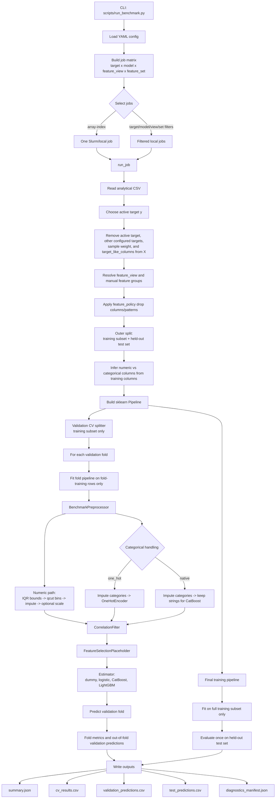

# Predictive ML Benchmark

Reusable benchmark package for comparing predictive models across targets,
model families, and feature-selection strategies.

The package is intentionally outside `scripts/hpc_processing` so the existing
HPC scripts can remain as historical/project-specific workflows while this
package becomes the reusable implementation.

## Current Scope

This first slice establishes:

- YAML config loading.
- `target x model x feature_view x feature_set` job-matrix expansion.
- Manual feature groups and feature views for comparing alternative clinical
  representations, such as raw, binary, or categorical vital-sign encodings.
- Model-specific feature policies for scaling, categorical handling, and
  correlation-filter behavior.
- Leakage-safe pipeline construction for imputation, encoding, scaling, qcut
  binning, IQR handling, correlation filtering, feature-selection placeholders,
  and the estimator.
- Cross-validation training and evaluation for dummy baselines, logistic
  regression, CatBoost, and LightGBM.
- Slurm array helper output.
- Slurm script rendering.
- Resource limits based on `SLURM_CPUS_PER_TASK`.
- Model registry stubs for dummy, logistic regression, random forest, CatBoost,
  LightGBM, and XGBoost.
- Homogeneous job output contract with `summary.json` and
  `diagnostics_manifest.json`.

Feature-selection caching, tuning, richer diagnostics, and aggregate reporting
are the next implementation slices.

## Leakage Rule

All data-dependent transformations must be learned from training data only.
The benchmark pipeline builder keeps these steps inside a fitted pipeline:

- missing-value imputation;
- one-hot category learning;
- scaling means/standard deviations;
- qcut bin learning;
- IQR outlier bounds;
- correlation-filter decisions;
- feature-selection decisions;
- model fitting.

Each job first creates a held-out test set using `split.test_size`. The test set
is not used for cross-validation, feature selection, model selection, or
preprocessing decisions. Cross-validation is then run only inside the remaining
training rows. Each validation fold builds and fits its own pipeline using only
that fold's training rows. After validation, a final pipeline is fitted on the
full training subset and evaluated once on the held-out test set.

## Helper Commands

The benchmark is launched through `scripts/run_benchmark.py`. The script reads
one YAML config, expands the configured job matrix, selects either one job or a
filtered subset, and then runs each selected job.

Print the job matrix:

```bash
python scripts/run_benchmark.py \
  --config scripts/ml_benchmark/configs/benchmark_mepram.yml \
  --print-job-matrix
```

Print the Slurm array line:

```bash
python scripts/run_benchmark.py \
  --config scripts/ml_benchmark/configs/benchmark_mepram.yml \
  --print-slurm-array
```

Print a full Slurm script:

```bash
python scripts/run_benchmark.py \
  --config scripts/ml_benchmark/configs/benchmark_mepram.yml \
  --print-slurm-script
```

Run one matrix entry in dry-run mode:

```bash
python scripts/run_benchmark.py \
  --config scripts/ml_benchmark/configs/benchmark_mepram.yml \
  --array-index 15 \
  --dry-run
```

Run one train/evaluate job:

```bash
python scripts/run_benchmark.py \
  --config scripts/ml_benchmark/configs/benchmark_mepram.yml \
  --target sepsis \
  --model logistic \
  --feature-view raw_vitals \
  --feature-set all_features
```

Completed jobs write `summary.json`, `cv_results.csv`,
`validation_predictions.csv`, `test_predictions.csv`,
`diagnostics_manifest.json`, `final_features.csv`, `imputation_report.csv`,
`correlation_matrix.csv`, and `correlation_pairs.csv` under
`outputs/ml_benchmark/.../jobs/<job_slug>/`.

`summary.json` includes a `benchmark_audit` section with row counts, feature
counts, target-like feature removal, feature-view filtering, imputation
strategies, qcut-created variables, IQR outlier handling, categorical encoding,
correlation filtering, and feature-selection status. Large tabular artifacts
are referenced from the summary and written as CSV files.

The runner removes every configured target column from `X`. Additional
target-like columns can be listed under `data.target_like_columns`; this is
where culture, organism, and resistance outcomes that are not the active target
should live.

## Pipeline Structure

At launch time, the CLI does not hard-code model inputs. The YAML config
controls the data path, targets, models, feature views, feature policies, split
strategy, and output location.



There are two leakage boundaries. First, the held-out test set is separated
before validation and is not touched until final evaluation. Second, inside the
validation fold loop, IQR bounds, qcut bins, imputation values, one-hot
categories, scaling parameters, correlation-filter decisions, feature-selection
decisions, and model parameters are all fitted only on the fold-training rows.

## Feature Views

Feature views are different representations of the same analytical table.
They are intentionally separate from feature selection:

- `feature_view`: which candidate columns are allowed into the model.
- `feature_set`: whether all candidates are used or a selector/cap is applied.

Manual feature groups define mutually meaningful alternatives:

```yaml
feature_groups:
  temperature:
    alternatives:
      raw:
        include: [temperatura]
        exclude: [temperatura_recoded, sintoma_fiebre, sintoma_fiebre_categorico]
      category:
        include: [temperatura_recoded, sintoma_fiebre_categorico]
        exclude: [temperatura, sintoma_fiebre]

feature_views:
  - name: raw_vitals
    include_patterns: ["*"]
    groups:
      temperature: raw
```

## Feature Policies

Feature policies define model-specific preprocessing rules. For example,
logistic regression can report/drop correlated features more aggressively while
tree models can keep correlation filtering as report-only or disabled:

```yaml
feature_policies:
  logistic_default:
    categorical_handling: one_hot
    scale: standard
    impute_numeric: median
    impute_categorical: most_frequent
    qcut_numeric: optional
    qcut_bins: 4
    iqr_outlier_handling: train_fit
    correlation_filter:
      enabled: true
      threshold: 0.80
      mode: report_then_drop
      manual_groups_first: true

  tree_default:
    categorical_handling: one_hot
    scale: none
    impute_numeric: median
    impute_categorical: most_frequent
    qcut_numeric: optional
    iqr_outlier_handling: train_fit
    correlation_filter:
      enabled: false
      mode: report_only

models:
  - name: logistic
    feature_policy: logistic_default
  - name: lightgbm
    feature_policy: tree_default
```

`categorical_handling: one_hot` is the default for sklearn, XGBoost, and
LightGBM-style estimators that need numeric matrices. `categorical_handling:
native` keeps categorical columns as imputed strings for CatBoost and passes
their column names to CatBoost as native categorical features. Numeric scaling
is controlled per policy with `scale: none`, `standard`, `minmax`, or `robust`;
tree policies normally keep `scale: none`.

Numeric and categorical imputation are also policy-specific. `impute_numeric:
median` and `impute_categorical: most_frequent` are the current defaults.
`qcut_numeric: optional` appends train-fitted quartile-style columns named
`<variable>_qcut`; `qcut_bins` controls the requested number of bins.
`iqr_outlier_handling: train_fit` learns IQR bounds on the training fold and
sets values outside those bounds to missing before imputation. Use
`iqr_multiplier` to change the bound width.

## Split Strategy

The config includes an explicit split strategy so the same package can support
cross-validation tuning now and train/validation/test evaluation later:

```yaml
split:
  strategy: cross_validation
  cv_splits: 5
  test_size: 0.20
  validation_size:
  random_state: 99
  stratify: true
```

With this strategy, `test_size` controls the outer held-out test split.
`cv_splits` controls the validation folds created only within the training
subset.
